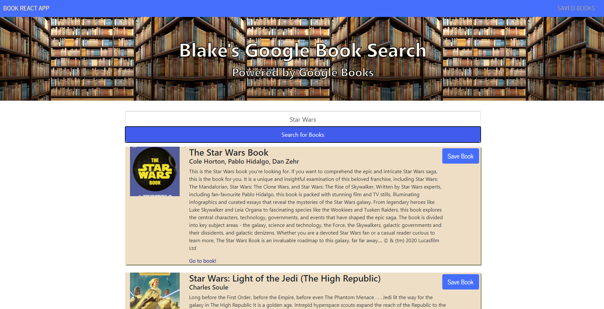

# Google Book Search

## Table of Contents
1. [ Description ](#desc)
2. [ Features ](#features)
3. [ Usage ](#usage)
4. [ Questions ](#quest)
    

## 1. Description
This application will provide give you the ability to search for a book title and will provide a list of books based on the search. You can scroll through the list of books that are found and save the book to your "Saved books" page. Any books saved will be stored on the saved books page until it is deleted on that page.

## Features

* Bootstrap
* Express
* Node.js
* React
* MongoDB
* Heroku

    

## 3. Usage
Search for a book title and be will provide a list of books based on the search. You can scroll through the list of books that are found and save the book to your "Saved books" page. Any books saved will be stored on the saved books page until it is deleted on that page.

 
<h3>Google Book Search</h3>

 

## 4. Questions
Please visit my GitHub to view all of my work:
https://www.github.com/bbrintle 

Check out the site:
https://blake-google-book-search.herokuapp.com/

Contact me at: bbrintle@gmail.com